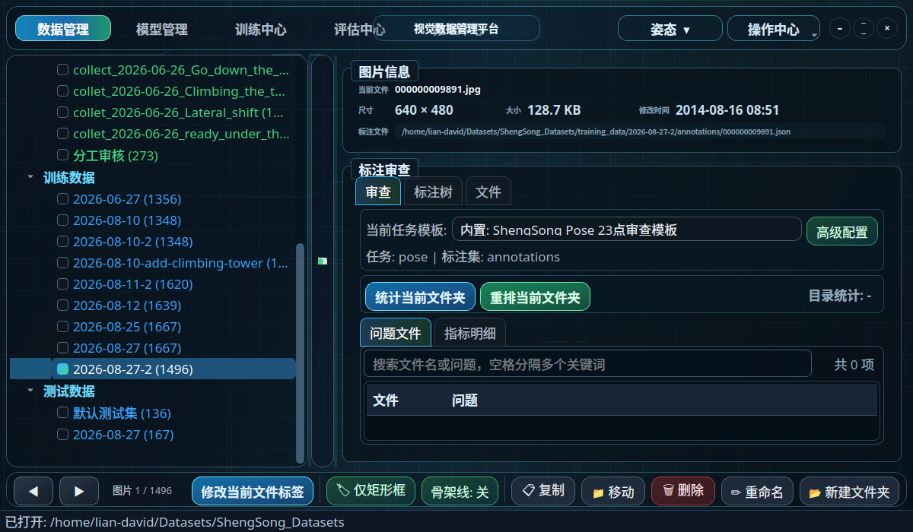
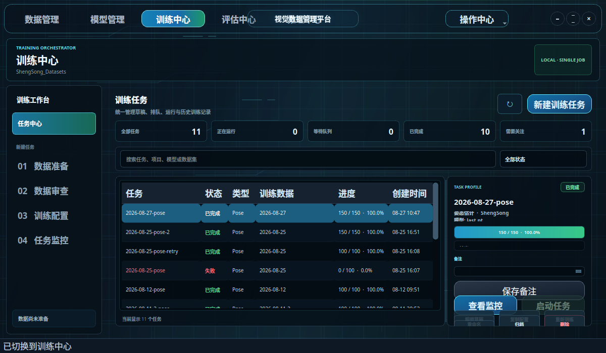
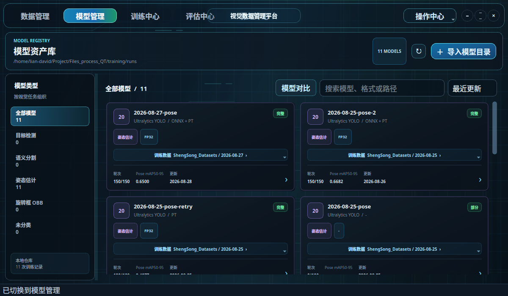
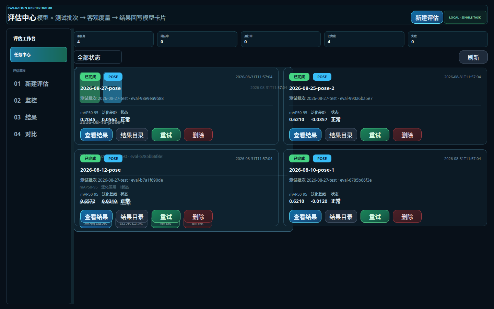
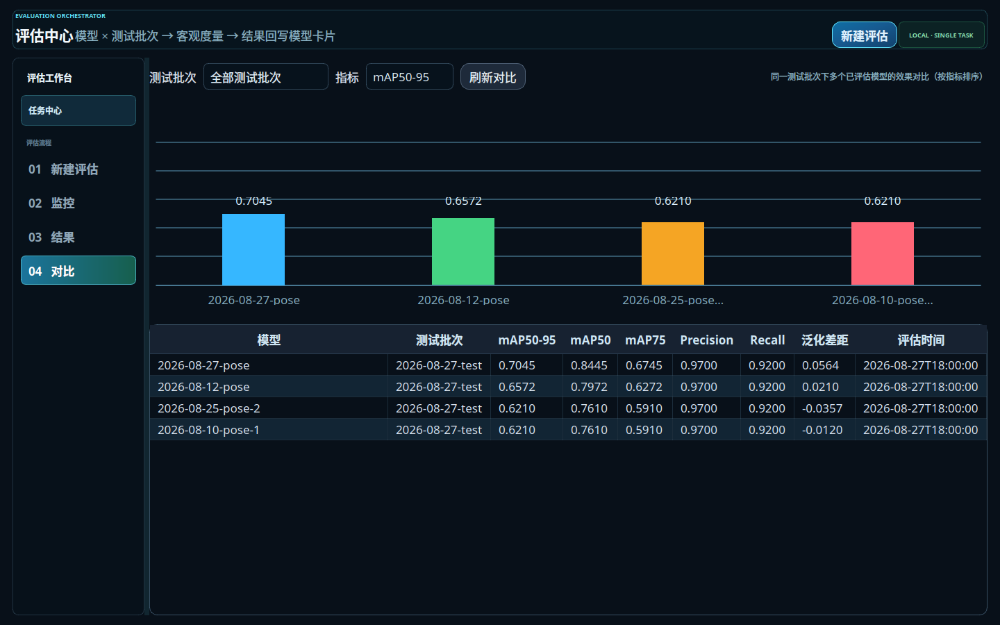
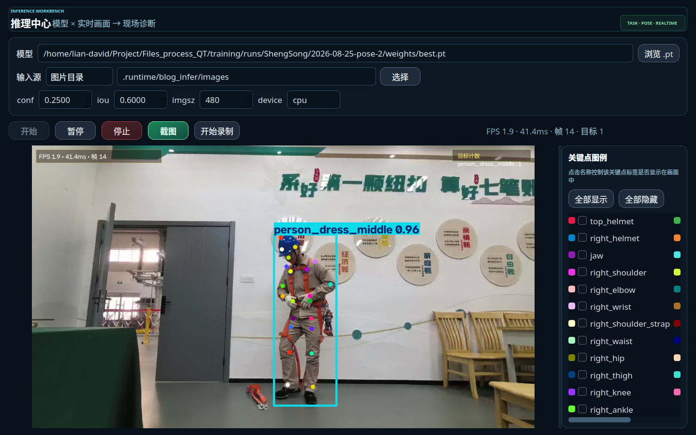

# YoloForge：从标注到推理的一站式 YOLO 视觉数据锻造平台（开源）

> **一句话定位**：一个基于 PyQt5 的本地桌面平台，把「视觉数据 → YOLO 模型」的全流程——数据管理、标注审查、数据准备、模型训练、客观评估、实时推理——装进一个深色科技风的五大中心里。
>
> 仓库地址：https://github.com/kallcurry/Yolo-one-stop-Forge

---

## 一、为什么要做这个平台

做 CV 项目的同学都懂这种"工具链地狱"：

- 数据散落在几十个批次目录里，审查靠肉眼翻图片；
- 标注工具导出的 JSON 和 YOLO 训练需要的 TXT 对不上，关键点顺序错一个，训练全崩；
- 划分训练/验证/测试集用脚本随机切，**一类样本全进训练集**，验证集永远缺类，mAP 虚高；
- 训练完的模型一堆 best.pt / last.pt，靠文件命名猜哪个最好；
- 评估一个模型要写临时脚本，换测试集、换指标全重来；
- 想上摄像头看看模型现场表现？又要写一个推理 demo。

**YoloForge 的答案是：把这些全部做进一个桌面应用，并且用「不写死」的方式做。**

> 平台的核心设计哲学：**类别数量、类别名、Pose 关键点数量、骨架拓扑，全部在运行时从数据中动态推断**——你以后换成 5 类、8 类、25 个关键点，代码一行都不用改。

---

## 二、五大中心，一次看全

### 1️⃣ 数据管理：看得见、管得住的原始数据



- 左侧数据树自动识别「项目根目录 + 分离式图片/标注/标签目录」约定，原始数据、训练数据、测试数据分组展示；
- 中间图片画布支持：滚轮缩放、拖拽平移、适应窗口，标注（框、关键点、骨架、多边形、旋转框）四种任务统一渲染；
- **审查高亮**：正常标注绿色，审查命中的异常点/异常框/异常连线红色，一眼定位；
- 右侧信息面板：图片信息、标注树、审查统计、问题文件列表（支持关键词搜索与图表联动）；
- 文件操作与标注联动：复制/移动/删除/重命名目录时**自动同步对应 JSON 标注**，改标签可通过独立子进程拉起 X-AnyLabeling，退出后自动检测文件变化并同步到训练/测试副本；
- **目录级重复审查**：按「文件大小 → 头尾快速指纹 → 完整 SHA-256」分阶段比对，图片/标注/标签三类各自去重；支持联动删除（删除重复图片时同步清理已确认重复的 JSON/TXT）、孤儿标注检出（缺图文件的标注可移出备份）、同名多版本检出（同文件多目录内容不同，可选保留版本）；
- 快捷键体系完善（Ctrl 系列 + 方向键翻页 + A 切换显示模式）。

### 2️⃣ 训练中心：训练任务的全生命周期管理



- **数据准备**：多批次收集 → 预检（缺 TXT、无效标签、结构列数不一致、同名冲突、非有限数值等）→ **按来源分层划分** train/val（每个来源独立抽验证，杜绝大批次霸占验证集）；
- **测试集独立划分**：可选测试集比例，测试样本写入独立批次 `test_data/<批次>/`（含 `dataset.yaml` 与 `test_manifest.json`），**训练批次中永不混入测试样本**；
- **跨任务划分一致性**：每次准备写入任务无关的 `split_manifest.json`；勾选「复用上次划分」后，同一批图做检测/分割/OBB 任务时 **train/val/test 分配完全一致**——跨任务比较合法、零数据泄漏；
- **动态 dataset.yaml**：类别数、类别名、`kpt_shape`、关键点顺序、`flip_idx` 全部从实际数据推导，不依赖固定列表；
- 训练任务：草稿/排队/运行/完成/停止/中断/失败全状态，断点续训（自动切到 `weights/last.pt` 恢复优化器与 Epoch），独立子进程运行——**训练崩溃不会拖垮主窗口**；
- 实时监控：Epoch、进度、运行时长、CPU/内存/GPU/显存、实时日志、损失/指标/学习率训练曲线；
- 每个任务保存**可复现快照**（dataset.yaml + 训练请求 + 独立可运行的 run_training.py）。

### 3️⃣ 模型管理：模型卡片化的仓库



- 扫描模型仓库，一次 Ultralytics 训练结果 = **一张模型卡片**（架构、输入尺寸、Batch、优化器、Epoch、权重格式、本地路径、训练数据来源）；
- 按任务类型筛选（Pose/检测/分割/OBB）；`results.csv` 曲线自动解析为可查看的评估曲线；
- **多模型对比**：逐轮训练曲线叠加、最佳指标柱状图、配置差异表；
- **评估回写**：模型卡片直接展示最近一次测试集评估（mAP50-95、泛化差距），并一键跳转评估中心/推理中心。

### 4️⃣ 评估中心：用真实场景数据给模型打分



- 正式评估数据源**只有独立测试批次**（训练 val 不参与正式评估），任务类型自动从测试批次 `test_manifest.json` 继承；
- 评估任务卡片流：状态徽章、mAP50-95/泛化差距/状态摘要、快捷操作（查看结果/结果目录/重试/删除）；
- 8 指标卡：mAP50-95 / mAP50 / **mAP75** / Precision / Recall / **训练 mAP50-95** / 泛化差距 / 时延 ms；按类别 AP 明细表；
- **数据指纹**：每次评估记录测试批次 `test_manifest.json` 的 SHA-256，测试集变更后结果标记失效——评估结果可追溯、可复现；
- 任务注册表 sqlite 持久化：**历史记录重启不丢**；子进程隔离，崩溃不拖垮界面。



- **同测试集多模型对比**：选择测试批次与指标，柱状图按指标降序排列（泛化差距支持负值向下）、全指标对比表、点击柱子直达结果页——一眼看出"谁在真实场景下最强、谁泛化差距最大"。

### 5️⃣ 推理中心：模型即开即用的现场诊断



- **四种输入源**：实时摄像头 / 视频文件（循环播放）/ 图片目录 / RTSP 网络流；
- 四任务推理：检测框、分割掩码、姿态骨架、OBB 旋转框自动绘制（复用 Ultralytics Annotator）；
- 画面 HUD：FPS、推理耗时、帧数、**实时目标计数板**（各类别数量）；
- **任务自适应图例**：Pose → 关键点图例（点选控制名称标签显隐，名称自动从训练 dataset.yaml 恢复）；检测/分割/OBB → 类别图例（点选控制对应框/掩码/旋转框显隐）；
- 截图保存（PNG + 参数/计数元数据 JSON）、实时视频录制（MP4）；
- 采集+推理在独立线程，**推理再慢界面不卡**；模型列表与模型管理仓库自动联动。

---

## 三、技术亮点（细节拉满）

| 亮点 | 说明 |
| --- | --- |
| **动态结构推断** | 类别/关键点顺序/骨架连接从 JSON、TXT、dataset.yaml 推导，共识顺序 + 按名重映射，文件点序不同也能对齐 |
| **转换器与官方逐字节对齐** | JSON→YOLO TXT 与 X-AnyLabeling 官方转换器规则完全一致（clamp、int 取整、difficult→可见性、缺失补零、OBB 四角点），并内置「TXT ↔ JSON 一致性校验」（配对/结构/数值比对，容差可调） |
| **数据安全** | 准备默认生成副本、删除先回收站、原子落盘（staging + rename）、SHA-256 复核、拒绝符号链接、备份目录保留相对路径 |
| **子进程隔离 + 事件流** | 训练/评估独立进程 + JSON 事件流协议（`@@FILESPROCESS_TRAIN/EVAL@@`），UI 永不阻塞、重启可恢复 |
| **结果契约** | `evaluation_result.json`（指标/每类/训练侧/差距/时延/指纹）是评估中心与模型管理的共同语言，零冗余元数据 |
| **启动自愈** | 自动清除 OpenCV Qt 插件路径污染（xcb 崩溃防护）、无显示环境自动 offscreen、全局异常钩子防「核心转储」 |
| **一条命令的健康检查** | `python deployment/doctor.py --require-label-tool`（Python/Qt 插件/OpenCV/Ultralytics/PyTorch/CUDA/写权限/pip check） |

## 四、安装与使用

```bash
git clone <repository-url> YoloForge
cd YoloForge

# 1. Conda 环境（Python 3.10/3.11）
conda env create -n vision-platform -f deployment/environment.yml
conda activate vision-platform

# 2. 安装依赖（GPU: cu128 / CPU: cpu）
bash deployment/install.sh --torch cu128

# 3. 启动
bash deployment/run.sh

# 4. 环境体检
python deployment/doctor.py --require-label-tool
```

首次启动选择数据目录后，平台自动记住目录、窗口尺寸与布局。支持四个任务：**Pose / Detection / Segmentation / OBB**（X-AnyLabeling JSON 标注 → YOLO TXT → Ultralytics 训练）。

## 五、适用人群

- 自建小样本 CV 数据集的**算法工程师/学生**：一个工具管理 "data → model" 全链路；
- 需要**多人分工审查**与**标注质量管控**的数据团队；
- 想快速验证模型真实场景表现、需要**现场推理演示**的项目组。

## 六、当前边界与路线

- 已上线：数据管理 / 训练中心 / 模型管理 / 评估中心 / 推理中心（五大模块）；
- 规划中：评估中心 FP/FN 样例可视化、onnx/engine 推理基准、多 GPU 任务调度、训练-评估自动循环、模型辅助标注。

---

**如果这个平台对你有帮助，欢迎 Star、Issue 交流，也欢迎提交你的使用场景与需求。**
仓库：https://github.com/kallcurry/Yolo-one-stop-Forge

---

## 附：发布小贴士（写给自己）

- **CSDN**：把 `docs/blog/images/*.png` 上传 CSDN 后，用上传后的链接替换文中相对路径；Markdown 直接支持上传图片插入；标题可参考三个备选：
  1. 《开源！PyQt5 打造的一站式 YOLO 视觉数据锻造平台：标注、训练、评估、推理全搞定》
  2. 《我把我散落成一堆脚本的 CV 工具链，做成了一套桌面平台（附源码）》
  3. 《YoloForge：从数据到模型，一个本地平台打通 YOLO 全流程》
- **知乎**：知乎编辑器支持 HTML 粘贴 Markdown；图片建议插图上传（每图 4-6 行文字解释），首图选 `06-推理中心-实时预览.png`（视觉冲击最强）。
- 文中演示数据来自真实项目（训练 11 个任务、模型 23 个关键点专项等），发布前可按需替换为你的脱敏描述。
