## 二、已有功能全景

### A. 数据接入与资产管理（imports / assets）

- ✅ **磁盘目录一键建候选 + 批量灌真实标注**：Labelme 解析 → `payload_json`
- ✅ 来源台账 + CSV 导出、图片资产注册、收藏集
- ✅ 空图确认、批次删除（事务级联）
- 🟡 导入预览/配对建议（逻辑真实，配对结果不持久化，每次重扫）

### B. 标注生产（annotation）

- ✅ 工作包（评审/修复）+ **租约防并发** + **标注历史版本链**（revision 多版本可回溯/选版）
- 🟡 **黄金集质检**（掺入已知答案图 → 提交比对 → 正确率/漏标率落库）——但标注员"保存"提交闭环缺失，整链在生产路径上走不通
- ✅ 一致性校准（双人 IoU 逐图真实比对）、场景属性人工评审（basis/决策/事件链）
- 🟡 前端标注工作台（图库分页 / overlay / 连续作业会话）——查看能力真实，**画完保存不落库**
- ❌ 预标注计划（prelabel 端点存在，执行器从未实现，空转）

### C. 质量与数据挖掘（quality）

- ✅ **错误聚类**（低置信 / 遮挡 / 小目标 / 缺关键点四模式）+ 按模式建修复包
- ✅ **主动学习队列**（最低置信度优先，JSONB 内 SQL 排序，不拉全量）
- ✅ 一致性 IoU 逐图比对、数据改进优先级 / 复核效率报告、校验报告
- ⚠️ 当前挖掘的 `score` 来自**导入时的静态标注快照**，不随模型更新（规划 P-008 升级为模型驱动）

### D. 数据集管理与版本治理（dataset）——全项目最强模块

- ✅ **数据版本冻结**（seed 可复现 70/15/15 物化 split 分配 + 样本清单 + release）
- ✅ 版本列表 / 详情 / 分布、**训练血缘**（run → 版本 → 1262 图清单）、**评估集纯净守卫**（test 图拒入回流）
- ✅ **数据漂移检测雏形**（版本 vs 候选分布 JS 散度）、完整性检查、split-plan 预览
- ⚠️ v001 旧格式样本（假路径）残留库中（规划 P-003 处置）

### E. 训练与评估（training）——动力源尚未打通

- 🟡 训练运行登记骨架（0 run / 0 权重 / 无执行器，字段齐但没人跑）
- ✅ F10 **数据质量口径指标**（框 / 关键点 / 类别分布真值；但这是"标注质量"，不是"模型精度"）
- ✅ F8 **细粒度评估矩阵**（类别 26 桶 / 难度 3 桶；同属标注质量口径）
- 🟡 模型发布生命周期（releases 事件链真实，但无真实权重资产，激活的是空壳）

### F. 任务与平台（tasks / system / operations）

- ✅ 后台任务登记 + 同步执行闭环
- ✅ 标注工作区恢复 / 回收、健康检查 / 存储就绪 / 系统状态、报告看板、规则方案 profiles

---

## 三、未来规划功能（按 Epic / 优先级）

### EPIC-001 数据飞轮主轴（P0 离线地基）——飞轮第一次完整自转的必经之路

| 项 | 内容 | 依赖 | 状态 |
|---|---|---|---|
| P-001 | 容器化（docker-compose + Dockerfile + nginx） | — | ready |
| P-005 | 进程型任务执行器（subprocess + 日志 + stop） | — | ready |
| P-006 | 训练引擎（ultralytics，权重落 MinIO + 三表登记） | P-005 | ready（**需批 AGPL**） |
| P-007 | 模型预测层（`model_predictions` 独立表，预测=候选不覆盖人工标注） | P-006 | ready |
| P-008 | 模型驱动信号（score 改吃预测 + mislabel 检测） | P-007 | ready |
| P-009 | 图库预测 overlay 双视图 | P-007 | ready |
| P-010 | 真评估（接权重 → mAP50/PCK，test split 口径） | P-006 | ready |
| P-011 | 固定评估套件 + 切片回归对比 | P-010 | ready |
| P-012 | 失败案例库（worst cases 自动入库转回流） | P-010 | ready |
| P-013 | embedding 管线（open_clip + pgvector） | P-002 | ready（**需批 open_clip**） |
| P-014 | 语义检索（以图搜图 + 文本搜图） | P-013 | ready |
| P-015 | 触发器框架 + 难例池（低置信 / 不一致 / 离群） | P-007 | ready |
| P-016 | 数据策展工作台（语义搜索 + 难例审批 + 回流） | P-014/P-015 | ready |
| P-017 | auto-label 预标执行器 | P-007 | ready |
| **P-018** | **标注修正提交端点**（无依赖，P0 最高优先，补齐最大单点缺口） | — | ready |
| P-019 | 审核仲裁流（提交→批准/驳回→审核队列） | P-018 | ready |
| P-020 | 增量版本 + 一键再训练（test 继承 + 新图进 train） | P-006/P-018 | ready |

基建前置：P-002 pgvector 切换 · 清理项：P-003 测试残留清理 · P-004 版本 diff。

### EPIC-005 线上运行时环（生产闭环主干）

| 项 | 内容 | 依赖 | 状态 |
|---|---|---|---|
| P-028 | 在线推理服务（模型常驻 + 热切换） | P-007 | ready |
| **P-036** | **线上数据流接入**（双通道统一底座：watch folder / HTTP 上传） | P-028 | ready（已建包） |
| P-037 | 事件驱动回流（低置信 / 业务事件 → 难例池） | P-036/P-015 | ready |
| P-039 | 持续训练调度（难例达阈值 → 增量版本 + 预填，人工批准） | P-020/P-037 | ready |
| P-040 | 线上监控看板（预测量 / 置信 / 线上漂移 / 回流统计） | P-036 | ready |
| P-038 | 隐私合规层（打码 / 留存 / 审计） | P-036 | backlog（**R3 需人工批准**） |

### EPIC-002 产能增强（backlog）

P-021 SAM 辅助修正 · P-022 多 run 实验对比表 · P-023 PR 曲线 / 混淆矩阵 · P-024 数据集健康报告 · P-042 FiftyOne 集成（idea）· P-043 多样性采样。

### EPIC-003 平台配套（backlog）

P-025 RBAC（**接生产前必做，当前全端点无鉴权**）· P-026 审计日志 · P-027 通知中心 · P-029 部署管理面板 · P-030 数据集卡片 · P-031 API Token。

### EPIC-004 规模依赖（idea）

P-032 超参搜索 · P-033 外部数据源连接器（S3/OSS/RTSP）· P-034 灰度发布（R3）· P-035 i18n · P-044 自监督预训练（十万级才值得）· P-045 自动富化。

---

## 四、数据飞轮流程图

### 4.1 主闭环（离线：数据 ↔ 模型自转一次完整循环）

```text
═══════════════════════════════════════════════════════════════════════
              数据飞轮 · 主闭环（离线：数据 ↔ 模型 自转一次完整循环）
═══════════════════════════════════════════════════════════════════════

   ① 数据接入                    ✅ 已完成 (F0/F1)
   [磁盘目录 + Labelme解析 → candidates / images / payload_json(score)]
                │
                ▼
   ② 数据版本冻结                 ✅ 已完成 (D0/F6/F7)
   [按 seed 70/15/15 物化 split 分配 + 样本清单 + artifact_release]
                │
                ▼
   ③ 训练引擎                    ⬜ 待做 (P-006, 依赖 P-005)  ← 需批 ultralytics(AGPL)
   [冻结版本 → 子进程训练 → 权重落 MinIO → model_assets/releases 登记]
                │
                ▼
   ④ 模型预测层                  ⬜ 待做 (P-007, 依赖 P-006)
   [批量推理 → model_predictions 独立表 (预测=候选, 绝不覆盖人工标注)]
                │
                ▼
   ⑤ 真评估                      ⬜ 待做 (P-010, 依赖 P-006)
   [接权重 → 冻结 test split → 真实 mAP50/PCK, 与数据质量口径并存]
                │
                ▼
   ⑥ 模型驱动挖掘 / 难例          ⬜ 待做 (P-008/P-015, 依赖 P-007)
   [score 改吃部署预测 + mislabel 检测 + 触发器(低置信/不一致/离群)]
                │
                ▼
   ⑦ 策展挑选                    ⬜ 待做 (P-016, 依赖 P-014/P-015)
   [语义搜图 + 相似图浏览 + 难例审批 + 一键建回流包]
                │
                ▼
   ⑧ 人工标注修正                ⬜ 待做 (P-018, 无依赖, P0第一优先) ← 全平台最大单点缺口
   [保存 → 新revision+1 → 黄金集自动评估 → 包进度流转 (租约防并发)]
                │
                ▼
   ⑨ 增量版本 + 一键再训练        ⬜ 待做 (P-020, 依赖 P-006/P-018)
   [父版本 test 集原样继承 + 新图进 train/val + 修订图保 split]
                │
                └───────────────┐
                                │ ⑨→③：修复完成 → 回到训练引擎，再次循环
                ▲───────────────┘

═══════════════════════════════════════════════════════════════════════
              数据飞轮 · 线上运行时环（EPIC-005 生产闭环主干）
═══════════════════════════════════════════════════════════════════════

   ⑩ 在线推理服务                ⬜ 待做 (P-028, 依赖 P-007)
   [模型常驻 + 激活即热切换 + 单图/批量同步推理 API]
                │
                ▼
   ⑪ 线上数据流接入              ⬜ 待做 (P-036, 依赖 P-028) ← 双通道统一底座
   [watch folder轮询/HTTP上传 → purpose='production'候选 → 复用dao_catalog → sha256去重]
                │
                ▼
   ⑫ 事件驱动回流                ⬜ 待做 (P-037, 依赖 P-036/P-015)
   [低置信/业务事件 → 线上帧自动入难例池 (复用触发器体系)]
                │
                ▼
   ⑬ 持续训练调度                ⬜ 待做 (P-039, 依赖 P-020/P-037, 人工批准闸门)
   [难例达阈值 → 自动建增量版本 + 预填再训练 → 人工一键批准]
                │
                ▼
   ⑭ 线上监控看板                ⬜ 待做 (P-040, 依赖 P-036)
   [预测量/置信分布/线上漂移(F9升级)/回流统计]

═══════════════════════════════════════════════════════════════════════
              平台底座（贯穿整个飞轮，多数是上文节点的前置）
═══════════════════════════════════════════════════════════════════════

   P-001 容器化(Dockerfile+compose+nginx)          ⬜ [P-036 上线前的硬前置]
   P-005 进程任务执行器(subprocess+日志+stop)       ⬜ [③④⑥⑬ 的共用基座]
   P-002 pgvector → P-013 embedding → P-014 语义检索 ⬜ [⑦⑩的依赖]
   P-003 测试残留清理 / P-004 版本 diff             ⬜
   P-019 审核仲裁流 / P-041 标注台集成(选型)         ⬜/⬜ [回流闭环的补充]
   P-025 RBAC / P-026 审计                         ⬜ [接生产前必做]
   P-021 SAM辅助 / P-042 FiftyOne / P-043 多样性采样 ⬜ [产能增强, backlog]

────────────────────────────────────────────────────────────────────────
   图例：  ✅=已实现且真实数据流转   🟡=半成(有端点无执行器/吃静态数据)
          ⬜=待做(规划)   ← 主闭环内的 ①~⑨ 是飞轮自转的全部环节
   关键依赖： 训练引擎(③) 是动力源；标注提交(⑧) 是回流闭环缺失的最后一脚
```

### 4.2 Mermaid 版（GitHub / 支持渲染的阅读器中显示更清晰）

```mermaid
flowchart TD
    subgraph OFFLINE["数据飞轮·离线主闭环 (数据↔模型自转)"]
        direction TB
        A1["① 数据接入<br/>磁盘目录+Labelme解析→灌库<br/>✅ F0/F1"]
        A2["② 数据版本冻结<br/>seed 70/15/15 物化+样本清单<br/>✅ D0/F6/F7"]
        A3["③ 训练引擎<br/>ultralytics→权重落MinIO<br/>⬜ P-006"]
        A4["④ 模型预测层<br/>model_predictions独立表<br/>⬜ P-007"]
        A5["⑤ 真评估<br/>冻结test split→mAP/PCK<br/>⬜ P-010"]
        A6["⑥ 模型驱动挖掘/难例<br/>score吃预测+mislabel+触发器<br/>⬜ P-008/P-015"]
        A7["⑦ 策展挑选<br/>语义搜图+难例审批+回流包<br/>⬜ P-016"]
        A8["⑧ 人工标注修正<br/>保存→新revision→黄金集评估<br/>⬜ P-018 (P0优先)"]
        A9["⑨ 增量版本+一键再训练<br/>test继承+新图进train<br/>⬜ P-020"]
        A1 --> A2 --> A3 --> A4 --> A5 --> A6 --> A7 --> A8 --> A9
        A9 --> A3
    end

    subgraph ONLINE["数据飞轮·线上运行时环 (EPIC-005)"]
        direction TB
        B1["⑩ 在线推理服务<br/>模型常驻+热切换<br/>⬜ P-028"]
        B2["⑪ 线上数据流接入<br/>watch folder/HTTP→production候选<br/>⬜ P-036"]
        B3["⑫ 事件驱动回流<br/>低置信/业务事件→难例池<br/>⬜ P-037"]
        B4["⑬ 持续训练调度<br/>难例达阈值→增量版本+预填再训练<br/>⬜ P-039"]
        B5["⑭ 线上监控看板<br/>预测量/置信/线上漂移/回流统计<br/>⬜ P-040"]
        B1 --> B2 --> B3 --> B4 --> B5
    end

    subgraph P0["平台底座 (多数节点的前置)"]
        direction LR
        C1["P-001 容器化"]
        C2["P-005 进程任务执行器"]
        C3["P-002 pgvector→P-013 embedding→P-014 语义检索"]
        C4["P-025 RBAC / P-026 审计"]
    end

    A4 --"预测供给线上环"--> B1
    B3 --"难例回流到⑥"--> A6
    C2 --"③④的基座"--> A3
    C1 --"P-036上线前置"--> B2
```



---